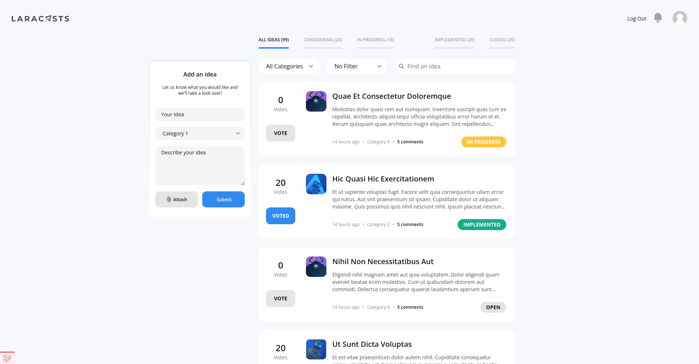
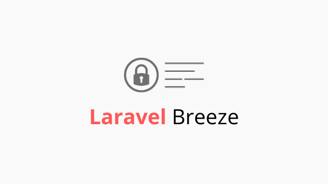
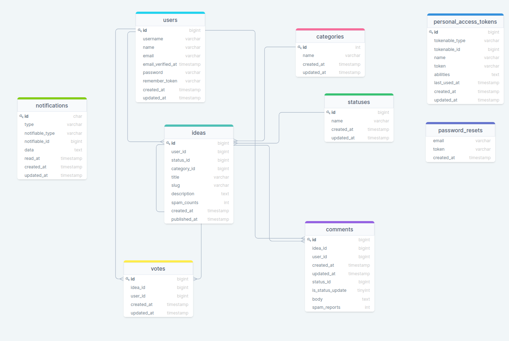

<p align="center"><a href="https://laravel.com" target="_blank"></a></p>

# Voting App

<p>
  This is a voting app. The app has two pages, main page for all the ideas and individual idea page. Users can add, edit, delete and vote ideas. Also you can add comments to the idea.
  
  Voting app has rich filtering functionlaity, you can filter ideas by category or by other filters, which includes following categories: Top Voted, My Ideas(*when you are authenticated user*) and Spam Ideas and Spam Comments(*when you are admin*). Also you can simply search something and if some part of idea contains the search term, it will show up. 

  Ideas have their statuses, which is one of the following choices: Open, Considering, In Progress, Implemented, Closed. <br>
  User can change status of own idea, but changing of status has time limitations.

  When you are admin, you can change statuses of all ideas, filter ideas by spam quantity and act accordingly, you can delet such idea or reset the spam counter.
</p>
<hr>



<hr>

- [Voting App](#voting-app)
  - [Installation](#installation)
  - [Used Tools](#used-tools)
  - [Prerequisites](#prerequisites)
  - [Database](#database)
  - [Resources](#resources)

## Installation

Clone this repository

```sh
git clone https://github.com/RedberryInternship/vakhtangchitauri-voting-app.git
```

Install the dependencies

```sh
composer install
```
```sh
npm install
```

Setup your .env file.

```sh
cp .env.example .env
```

Then create the necessary database.

```
php artisan db
create database votingApp
```

And run the initial migrations and seeders.

```
php artisan migrate --seed
```

## Used Tools

-    [Laravel Breeze](https://laravel.com/docs/8.x/starter-kits) - Starter Kit
-    [Laravel Mix](https://laravel-mix.com/) - Compiler
-    [Tailwind CSS](https://tailwindcss.com/resources) - CSS framework
-    [JWT Auth](https://jwt-auth.readthedocs.io/en/develop/) - Authentication

## Prerequisites

-    *PHP@7.3 and up*
-    *Sqlite@3.36 and up*
-    _npm@6 and up_
-    _composer@2 and up_
-    node@12 and up

## Database

schema made with **https://drawsql.app/**



See diagram here https://drawsql.app/redberry-9/diagrams/voting-app

## Resources

[Drawsql](https://drawsql.app/)

[Tailwind UI](https://tailwindui.com/)

